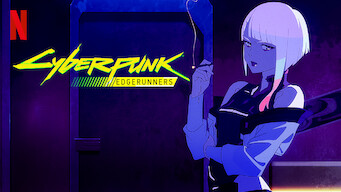

color fondo body --> #141414

<!-- LIBRERIA PARA HACER EFECTOS EN LAS IMAGENES (en el link estan los efectos) -->

https://imagehover.io/#download

<!-- COPIAR Y PEGAR DENTRO DE HEAD -->
<link rel="stylesheet" href="https://cdnjs.cloudflare.com/ajax/libs/imagehover.css/2.0.0/css/imagehover.min.css">

<!-- Copiar a partir de 'CARD' hasta </figure> -->

<!-- CARD -->
<figure class="imghvr-flip-diag-1">
        <!-- IMAGEN -->
    
        <!-- TEXTO -->
    <figcaption>
        
        <h3>NOMBRE DE LA SERIE/PELICULA</h3>

        
DESCRIPCION

    </figcaption>
</figure>

<!-- Estilos HEADER -->
display --> flex

Propiedades de flexbox para alinear el header

Width de la imagen del logo --> 20%

<!-- AYUDA: El header del html deberia quedar asi -->
    <header>
        
        
    </header>

<!-- Estilos MAIN -->
display grid

grid-template-columns: repeat(auto-fit, minmax(250px, 1fr));

column gap --> 100px
row gap --> 25px

<!-- COPIAR Y PEGAR EN STYLE.CSS -->
@font-face {
    font-family: 'Netflix Sans';
    src: url('./fuentes/NetflixSans_W_Md.woff2') format('woff2');
}

*{
    padding: 0;
    margin: 0;
    box-sizing: border-box;
}

figure, figcaption{
    background-color: black !important;
    border-radius: 5px;
    cursor: pointer;

}

figcaption{
    display: flex;
    flex-direction: column;
    justify-content: space-between;
}

body{
    background-color: #141414;
    font-family: 'Netflix Sans', sans-serif;
    width: 80%;
    margin: auto;
}